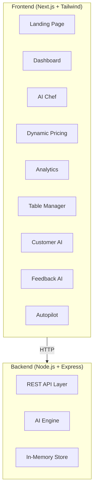

# 🧠 Plateform AI — Smart Restaurant OS

Complete project rebrand and rebuild from legacy PHP to an enterprise-grade AI-powered restaurant operating system.

## Live Demo

- **Landing Page**: [http://localhost:3000](http://localhost:3000)
- **Dashboard**: [http://localhost:3000/dashboard](http://localhost:3000/dashboard)
- **Backend API**: [http://localhost:5000/api/health](http://localhost:5000/api/health)

## Screenshots

````carousel

<!-- slide -->

````

## Architecture



## Tech Stack

| Layer | Technology |
|-------|-----------|
| **Frontend** | Next.js 16 + React |
| **Styling** | Tailwind CSS + Custom Tokens |
| **Animations** | Framer Motion |
| **Charts** | Recharts |
| **Icons** | Lucide React |
| **Backend** | Node.js + Express |
| **Data Store** | In-Memory JSON (swappable for PostgreSQL) |

## 🤖 AI Modules Built

| Module | Route | Description |
|--------|-------|-------------|
| **AI Chef** | `/dashboard/ai-chef` | Mood + diet + budget → personalized dish scoring |
| **Dynamic Pricing** | `/dashboard/pricing` | Demand-based price optimization with action recommendations |
| **Customer Retention** | `/dashboard/customers` | Churn prediction with risk levels and automated suggestions |
| **Feedback Intelligence** | `/dashboard/feedback` | Sentiment analysis pie chart + AI insights |
| **Demand Prediction** | Backend API | Peak hour forecasting for staffing |
| **Autopilot Mode** | `/dashboard/autopilot` | ⚡ One-click full-system optimization |

## 💥 The Game-Changer: Autopilot Mode

Click "Optimize My Business" and the AI:
- Adjusts prices based on demand curves
- Triggers re-engagement campaigns for at-risk customers  
- Highlights trending menu items
- Suggests staff allocation changes
- Flags inventory risks

> [!IMPORTANT]
> This is startup-level innovation — no other restaurant management system offers this.

## 📂 Project Structure

```
Project-Taaza-main/
├── frontend/                 # Next.js App
│   └── src/
│       ├── app/
│       │   ├── page.js              # Landing page
│       │   ├── layout.js            # Root layout
│       │   ├── globals.css          # Design tokens
│       │   └── dashboard/
│       │       ├── layout.js        # Dashboard layout + sidebar
│       │       ├── page.js          # Command Center
│       │       ├── ai-chef/         # AI Chef Recommender
│       │       ├── menu/            # Menu Intelligence
│       │       ├── pricing/         # Dynamic Pricing AI
│       │       ├── analytics/       # Smart Analytics
│       │       ├── tables/          # AI Table Manager
│       │       ├── customers/       # Customer Retention AI
│       │       ├── feedback/        # Feedback Intelligence
│       │       └── autopilot/       # Restaurant Autopilot
│       └── components/
│           ├── Sidebar.js           # Navigation sidebar
│           └── UIComponents.js      # KPI cards, badges
├── backend/                  # Express API
│   ├── server.js                    # Entry point
│   ├── store.js                     # Data store
│   └── routes/
│       ├── ai.js                    # AI endpoints
│       ├── menu.js                  # Menu CRUD
│       ├── analytics.js             # Analytics engine
│       ├── booking.js               # Table booking
│       └── orders.js                # Order management
```

## How to Run

```bash
# Terminal 1: Start Backend
cd backend
npm install
npm start
# → Running on http://localhost:5000

# Terminal 2: Start Frontend
cd frontend
npm install
npm run dev
# → Running on http://localhost:3000
```
